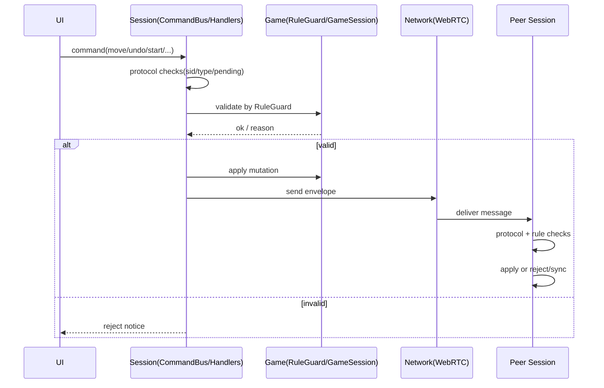
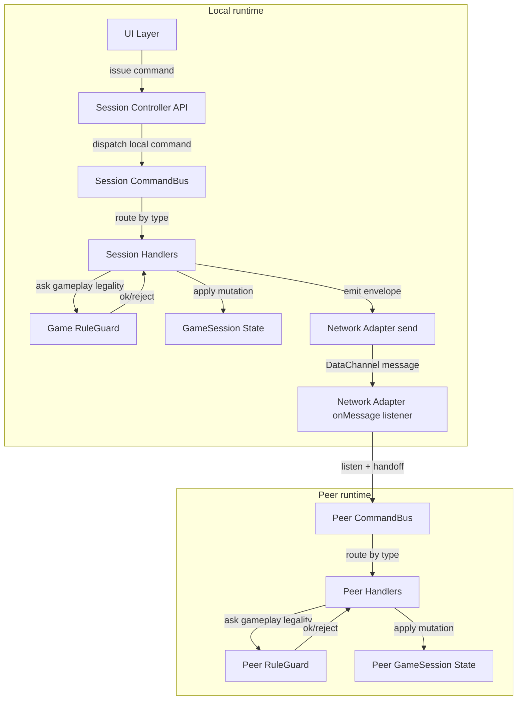
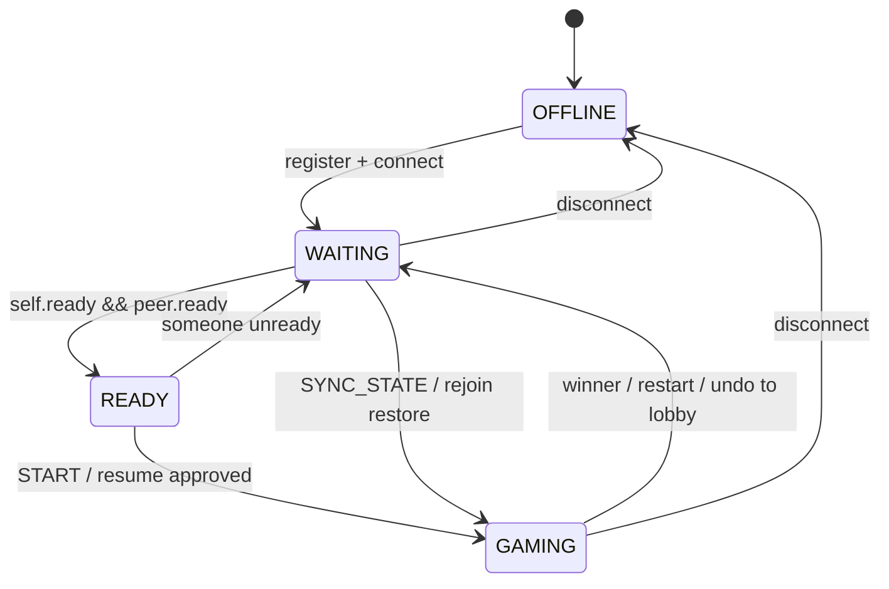
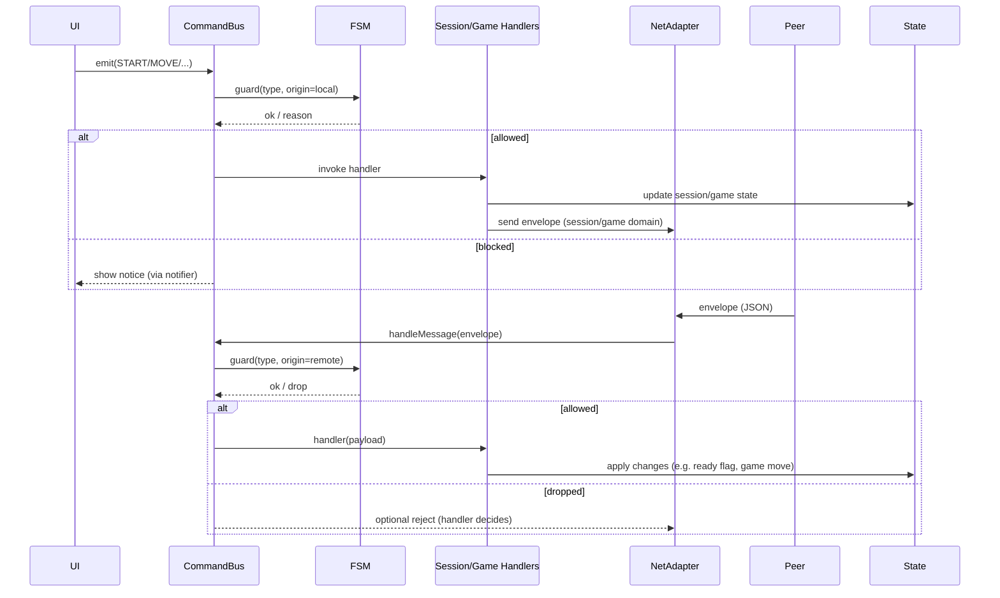
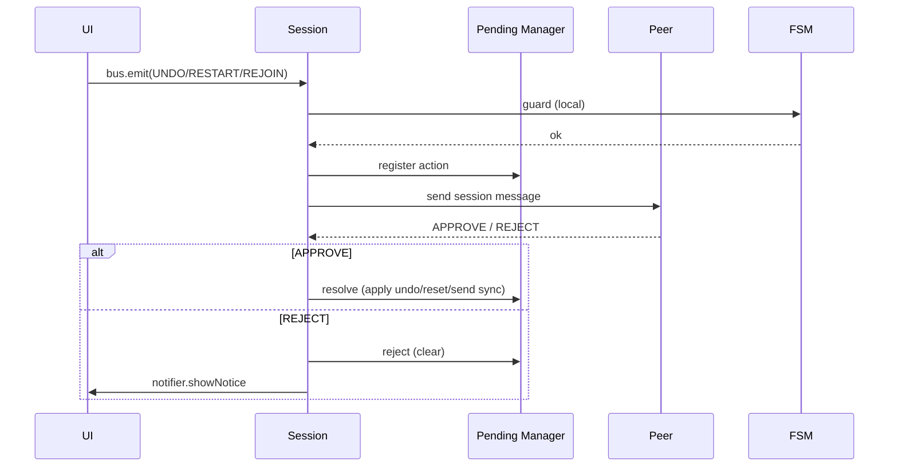
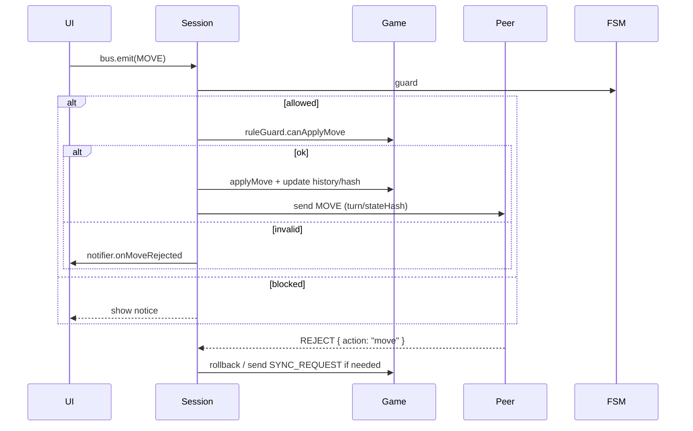

# p2p-lockstep-kit Design Notes (v0.1, Turn-Based P2P)

Network layer walkthrough:

- English: [docs/network-architecture-en.md](docs/network-architecture.md)
- 中文: [docs/network-architecture-zh.md](./docs/network-architecture-zh.md)

Goal: provide a browser-first P2P session and message protocol layer for turn-based games, wrapping WebRTC DataChannel (data plane) and WebSocket (signaling/control plane). Target games: gomoku, chess, mahjong, Three Kingdom, and other turn-based/strategy games.

---

## 1. Scope and Principles

### 1.1 Out of Scope
- DHT / PubSub / IPFS.
- Game rules or authoritative arbitration.
- Server authority (server is only for control plane/signaling/room coordination).

### 1.2 In Scope
- **Session management**: rooms, members, state machine (lobby/playing/reconnecting/ended).
- **Message protocol**: Envelope, seq, de-dup, anti-replay, stream multiplexing.
- **Connection orchestration**: WebRTC negotiation, state monitoring, auto-reconnect/re-negotiate.
- **Consistency support**: stateHash checks, snapshots, desync detection.
- **Game adapter**: IGameSession to isolate game logic from networking.

---

## 2. Layers and Responsibilities

### 2.1 Session Layer
One-line: Orchestrates room lifecycle, rejoin/sync, and command dispatch.
- Room lifecycle (register/connect/start/rejoin/leave).
- Reconnect + recovery (SYNC_REQUEST / SYNC_STATE).
- CommandBus: unify local actions and remote messages into one path.

Command flow (single pipeline, two origins):

```mermaid
flowchart LR
  UI[UI Action] --> API[Session API]
  API --> LBUS[CommandBus.emit origin=local]
  LBUS --> MID1[Middlewares]
  MID1 --> LH[Handler local branch]
  LH --> LG{RuleGuard + Session checks}
  LG -->|pass| APPLY1[State apply + Render]
  APPLY1 --> SEND[Net send Envelope]
  LG -->|reject| NOTICE1[Local notice / ignore]

  SEND --> RCV[Peer net.onMessage]
  RCV --> RBUS[Peer CommandBus.handleMessage origin=remote]
  RBUS --> MID2[Middlewares]
  MID2 --> RH[Handler remote branch]
  RH --> RG{RuleGuard + turn/hash checks}
  RG -->|pass| APPLY2[Peer state apply + Render]
  RG -->|reject| BACK[Send REJECT or SYNC_REQUEST]

  BACK --> HOME[Local net.onMessage]
  HOME --> HBUS[Local CommandBus.handleMessage origin=remote]
  HBUS --> MID3[Middlewares]
  MID3 --> HH[Handler return branch]
  HH --> FIX[Rollback / SyncState apply / Approve apply]
  FIX --> RENDER[Render UI]
```


Legality and control ownership:
- Session handlers control protocol legality: envelope type/room scope, pending request flow, approve/reject/rejoin/sync.
- Game rules own gameplay legality (`src/game/rules`); handlers only orchestrate apply/send/reject.
- Network only transports; it does not decide game legality.

Responsibility sequence (who owns what):


Command ownership map (control, dispatch, listen):


### 2.2 Protocol / Envelope Layer
One-line: Defines message shapes for signaling (server) and game data (peer).
- **Two protocols**: signaling (WebSocket) and game data (DataChannel).
- Signaling focuses on room + SDP/ICE exchange (no game fields).

#### Session/Game protocol split (parallel design)
- **Decision**: keep session and game protocols parallel and only share the base envelope (`type/from/seq/turn/stateHash`).
- **Pros**: keeps routing/handlers clear (`SESSION_READY` vs `GAME_MOVE`), lets FSM gate session messages without touching game logic, and allows domain-specific rejects (`SESSION_REJECT`, `GAME_REJECT`) so UI knows whether to rollback or just show a notice.
- **Cons mitigated**: need to duplicate a few helper senders (`sendSession`, `sendGame`) and make sure shared envelope utilities stay in sync, but avoids the longer-term ambiguity that nested domain fields introduced.
- **Reject payloads**: carry `{ domain: 'session' | 'game', action: 'ready' | 'move' | ... , reason }` so both pipelines can reuse the same wire type if needed while still signaling which layer should react.
- Peer protocol is split by domain:
  - `session` domain: `READY/START/UNDO/RESTART/APPROVE/REJECT/REJOIN/SYNC_*` (no `turn` required for ready/start).
  - `game` domain: `MOVE` and other board actions (uses `turn/stateHash`, no `sid` in payload).

#### Session FSM overview

FSM guards Commands so the controller only processes messages that are legal in the current phase (e.g. local `START` only fires in `READY`, `MOVE` only in `GAMING`). Transitions are triggered by handler hooks: ready toggles, match start/end, and connection state changes.

#### Message path (local vs remote)

Key ownership:
- UI emits local commands via the bus; FSM decides legality per phase.
- Handlers orchestrate session/game state updates and call NetAdapter to send envelopes when needed.
- NetAdapter parses incoming envelopes, annotates domain/type, and feeds them back into the same bus so remote events take the identical path.
- **Listeners & hooks (where they live):**
  - CommandBus: registered in `session/controller.ts`, routes every envelope (local + remote) through FSM guard + handlers.
  - NetAdapter: controller wires `net.onMessage` → `bus.handleMessage` and `net.onConnectionState` → `createConnectionControl` (inside `session/hooks/connection.ts`).
  - Pending manager: controller subscribes to `pending.onChange` to show "waiting/approved/rejected" notices; handlers call `pending.begin/resolve/reject` for UNDO/RESTART/REJOIN.
  - UI bindings: the shell UI exposes `bindEvents`, and controller connects them to `bus.emit(...)` (async handlers). All listeners/hook registration sits at the controller layer so other modules stay pure.

End-to-end flow:
- **Local action**: Player clicks the UI → `controls.bindEvents` calls into session API → `commandBus.emit` pushes the command through FSM guard → handler updates game/session state and, if applicable, sends a game/session envelope via `messageSender` → NetAdapter forwards it on the existing DataChannel.
- **Remote action**: NetAdapter receives JSON → controller hands it to the command bus → FSM guard + handlers run the same logic, updating state and triggering UI (e.g., prompts, notices). `REJECT {action:"move"}` always routes to the move handler for rollback; other rejects go to the pending manager.
- **Pending requests**: `undo/restart/rejoin` use `pending.begin()` (Promise) so UI buttons stay disabled until `APPROVE/REJECT` arrives. The pending manager emits phase changes (`idle/waiting/resolved/rejected`) so controller can show "waiting" notices. Disconnects call `pending.clear()` so no stale Promises remain.
- **Move ordering**: RuleGuard + turn/hash checks prevent “two moves in a row” — any MOVE whose `turn` or legality is invalid is rejected immediately and the sender rolls back or requests SYNC.

#### Immediate vs pending commands
- **Immediate commands**: `MOVE`, `READY`, `START`, `SYNC_REQUEST`, `SYNC_STATE`. They run entirely through the command bus + handlers + game adapter. `MOVE` may still receive a `REJECT` (hash mismatch, illegal move) and rolls back immediately, but there is no UI-level approval flow.
- **Pending actions**: `UNDO`, `RESTART`, `REJOIN`. These require peer approval, so the session keeps a pending-action record (type + payload). Only when `APPROVE` arrives does the session apply the change (undo board, reset to lobby, send SYNC_STATE); `REJECT` clears the pending entry and shows a notice.
- `APPROVE/REJECT` routing:
  - `action === "move"` → handled by the move handler (rollback/hash + SYNC).
  - Other actions → handled by the pending-action manager (`state/pending.ts` + handlers) to resolve/reject the outstanding request.

Pending action lifecycle:


Immediate MOVE path with reject handling:


#### Game rules and `IGamePlugin`
- Gameplay legality lives entirely in the **game layer** (`src/game`). Each plugin implements `IGamePlugin` and returns an `IGameSession` with `applyMove`, `undoMove`, `getRuleGuard`, `getSnapshot`, etc.
- Session state instantiates the plugin (`createSessionState` → `plugin.create(...)`) and delegates all rule checks via `game.getRuleGuard().canApplyMove(...)`. Session only decides protocol legality (READY/START/REJOIN) and consistency (turn/hash compare).
- The gomoku playground demonstrates the contract:
  ```ts
  import { createShell } from "../../src";
  import { gomokuPlugin } from "./gomoku-plugin";

  const shell = createShell({
    mount: shellUi.elements.boardWrap,
    plugin: gomokuPlugin,
    ui: {
      updatePanel: shellUi.updatePanel,
      log: shellUi.log,
      promptUndo: shellUi.promptUndo,
      showStart: shellUi.showStart,
      showWinner: shellUi.showWinner,
    },
  });
  shell.start({ autoRegisterUrl: shellUi.panel.refs.signalUrl.value });
  ```
  Inside `gomokuPlugin` (see `playground/gomoku-demo/src/gomoku-plugin/index.ts`) the plugin exposes `getRuleGuard` to block illegal moves and supplies `applyMove/undoMove` so the session can mutate the board after messages pass validation.
- Refer to `docs/session-overview.md` for a deeper walkthrough of the session modules and how they collaborate with the game adapter.

### 2.3 Controller Layer (Flow Control)
One-line: Pure logic that routes messages, tracks seq, and emits events.
> No browser or network dependencies.
- Envelope creation and parsing.
- Seq tracking and sliding window de-dup.
- Stream routing and event dispatch.
- Light consistency helpers (hash checks → desync signal).

**Session Flow (register/connect orchestration)**
- Sits beside the controller to handle imperative networking tasks: calling `net.register(url)` with retry policy, caching the returned peerId, and auto-connecting when `autoConnectId` is provided.
- Invokes `net.connect(targetId)` to build the WebRTC peer connection + DataChannel, logs progress to the UI, and notifies the controller once the link is established.
- Keeps these register/connect concerns out of the FSM/command bus, so protocol/state logic stays pure while flow owns side effects like retries and UI notices.

### 2.4 Transport Layer
One-line: A thin, uniform wrapper around WebRTC DataChannel IO.
- Wrap WebRTC DataChannel into ITransport.
- Connection state mapping + send/receive bytes.

### 2.5 Rendezvous Layer
One-line: Handles peer discovery and WebRTC negotiation via WebSocket.
- WebSocket connect + room management.
- SDP offer/answer and ICE candidate exchange.
- Optional heartbeat/online presence.
- Uses the **signaling protocol**, separate from game data protocol.

### 2.6 Serialization Layer
One-line: Encodes and decodes messages on the wire.
- v0.1 uses JSON.
- Future: msgpack/protobuf.

### 2.7 IGameSession (Game Side)
One-line: The game-owned boundary for rules, actions, snapshots, and hashes.
> Implemented by the game; session does not know rules.
- canApplyMove(move)
- applyMove/undoMove
- getSnapshot()/applySnapshot(snapshot)
- getHash()

---

## 2.8 Shell + Game Plugin (Demo Wiring)
This repo now uses a simple Shell + GamePlugin split in the demos.

Game plugin minimal contract (TypeScript):
```ts
export type GamePlugin = {
  id: string;
  title: string;
  create: (ctx: GameContext) => GameInstance;
};
```

Minimal wiring example:
```ts
import { createShell } from "./src/ui/shell";
import { gomokuPlugin } from "./playground/gomoku-demo/src/gomoku-plugin";
import { createShellUi } from "./src/ui/shell/ui";

const ui = createShellUi();
document.querySelector("#app")?.append(ui.elements.container);

const shell = createShell({
  mount: ui.elements.boardWrap,
  plugin: gomokuPlugin,
  ui: {
    updatePanel: ui.updatePanel,
  },
});

ui.panel.bindEvents({
  onConnect: shell.onConnect,
  onShare: () => {},
});

shell.start({ autoRegisterUrl: ui.panel.refs.signalUrl.value });
```

Desktop-first layout:
```ts
import { createShell } from "./src/ui/shell";
import { gomokuPlugin } from "./playground/gomoku-demo/src/gomoku-plugin";
import { createDesktopShellUi } from "./src/ui/desktopShell";

const ui = createDesktopShellUi({ defaultSignalUrl: "ws://localhost:8787" });
document.body.append(ui.elements.container);

const shell = createShell({
  mount: ui.elements.boardWrap,
  plugin: gomokuPlugin,
  ui: {
    updatePanel: ui.updatePanel,
    log: ui.log,
    promptUndo: ui.promptUndo,
    promptRestart: ui.promptRestart,
    showNotice: ui.showNotice,
  },
});

ui.panel.bindEvents({
  onConnect: shell.onConnect,
  onShare: () => ui.shareLink({
    peerId: ui.getPeerId(),
    signalUrl: ui.panel.refs.signalUrl.value,
    title: "Share desktop link",
  }),
});

ui.controls.bindEvents({
  onReady: shell.onReady,
  onStart: shell.onStart,
  onUndo: shell.onUndo,
  onRestart: shell.onRestart,
});

shell.start({ autoRegisterUrl: ui.panel.refs.signalUrl.value });
```

To add a new game, implement `GamePlugin` and swap the plugin import.
Use `templates/game-plugin.ts` as a starting point.

No `HELLO` message is required on DataChannel connect; session id is carried by
the envelope `sid`.

---

## 2.9 Recent Refactor Notes
- Codebase split into `src/utils` (protocol/serialization/logger), `src/network` (signaling/transport), `src/game` (move/undo/rules), `src/session` (room/rejoin/ready + CommandBus), and `src/ui` (shell UI).
- Session controller lives under `src/session`, UI shell is a thin wrapper.
- Signaling, protocol, transport, serialization consolidated under `src/utils` + `src/network`.
- Register retry policy extracted with exponential backoff and configurable rules.
- Connection state is event-driven (no polling) via `onConnectionState`.
- Centralized logging via `Logger` with a console default.
- Session now uses a dedicated FSM + pending-action manager; gameplay legality still lives in the game plugin via RuleGuard.

## 3. Sync Model (Turn-Based First)

### 3.1 Choice
v0.1 defaults to **lockstep**: turn-based actions, only the current player sends action.

### 3.2 Consistency
Each GAME_ACTION includes stateHashAfter; compare locally after apply.

### 3.3 Desync Handling
- On mismatch: SYNC_REQUEST.
- Peer replies with SYNC_STATE snapshot.

### 3.4 When to Consider Rollback
- Real-time, low-latency input feel (fighters/FPS/platformers).
- Turn-based games typically do not need rollback.

---

## 4. Public API (Game Contract)

### 4.1 Session
- createRoom() / joinRoom(invite)
- start() / leave()
- send(stream, type, payload)
- sendGameAction(action)
- requestSync()

Events:
- stateChanged
- peerJoined / peerLeft
- connected / disconnected
- desync

### 4.2 Signaling Protocol (WebSocket, v0.1)
Purpose: register + relay only. Keep it minimal.

Common envelope (type + from/to + payload):
```json
{
  "type": "REGISTER",
  "from": "peerId",
  "to": "peerId?",
  "payload": { "id": "", "data": "" }
}
```

Core message types (minimal set):
- REGISTER (client -> server)
- REGISTERED (server -> client, returns generated peerId)
- RELAY (client -> server -> peer, payload is forwarded as-is)
- ERROR (server -> client, error info in payload)

Notes:
- Server only stores online peers and forwards RELAY messages.
- If `to` is not online, server responds with ERROR (payload contains error info).

Connection flow (two peers):

```
Client A            Signaling Server             Client B
   |                       |                       |
   |--- WS connect ------->|<------ WS connect ----|
   |--- REGISTER --------->|                       |
   |<-- REGISTERED --------|                       |
   |                       |<-------- REGISTER ----|
   |                       |-------- REGISTERED -->|
   |                       |                       |
   |--- RELAY(offer) ----->|---- RELAY(offer) ---->|
   |<-- RELAY(answer) -----|<--- RELAY(answer) ----|
   |--- RELAY(ice) --------|---- RELAY(ice) ------>|
   |<-- RELAY(ice) --------|<--- RELAY(ice) -------|
   |                       |                       |
   |===== DataChannel open (P2P) ==================|
   |<======== Game Protocol messages =============>|
```

### 4.3 Game Protocol (DataChannel, v0.1)
Purpose: in-game control + sync. Keep it minimal.

Common envelope:
```json
{
  "type": "GAME_ACTION",
  "sid": "sessionId",
  "from": "peerId",
  "seq": 12,
  "turn": 5,
  "stateHash": "hash?",
  "payload": {}
}
```

Notes:
- `seq` is per-sender monotonic for de-dup and ordering checks.
- `turn` is the global turn counter for lockstep.
- `stateHash` is optional but recommended for desync detection.

Minimal message types:
- GAME_ACTION (send action for the current turn)
- SYNC_REQUEST (ask for snapshot)
- SYNC_STATE (send snapshot)

---

## 4.4 Minimal Requirements Analysis

Goal: determine the smallest feature set needed for a turn-based P2P game, and what WebSocket/WebRTC already provide.

Minimum features you must build (application layer):
- **Room coordination**: who is in the room, roles/seats, and when the game can start.
- **Signaling messages**: exchange SDP/ICE via the server to establish the P2P link.
- **Game message protocol**: define action types and payloads (game rules are outside the kit).
- **Turn/sequence logic**: validate actions by turn and drop duplicates.
- **State sync fallback**: request/receive snapshots when a desync is detected or on reconnect.

Provided by WebSocket (you do NOT build these):
- **Server connection**: persistent client-server channel.
- **Message delivery to server**: ordered, reliable transport between client and server.
- **Backpressure**: socket buffering and readyState checks.

Provided by WebRTC DataChannel (you do NOT build these):
- **P2P data transport**: direct client-to-client channel after negotiation.
- **Reliability & ordering**: if you use default settings (reliable + ordered).
- **NAT traversal**: ICE/STUN/TURN mechanisms handled by WebRTC stack.

Not provided by WebSocket/WebRTC (you must build or decide):
- **Room logic**: join rules, max players, roles, permissions.
- **Protocol semantics**: message types, fields, validation rules.
- **Game consistency**: turn tracking, state hashing, snapshot sync policy.
- **Security policy**: auth, anti-abuse, rate limits, optional signing.
---

## 5. Repository Structure (Current)

```
/-p2p-lockstep-kit
  /src
    /utils
      /protocol
      /serialization
      logger.ts
      index.ts
    /network
      /signaling
      /transport
      /state
      index.ts
    /game
      /handlers
      /rules
      types.ts
    /session
      /controls
      /handlers
      /ports
      /rejoin
      /state
      commandRegistry.ts
      commandMiddleware.ts
      pendingState.ts
      flow.ts
      net.ts
      policy.ts
      index.ts
    /ui
      /shell
        /ui
      index.ts
    index.ts (facade)
  /playground
    /playground-webrtc
    /playground-signaling
    /playground-signaling-webrtc
    /gomoku-demo
  package.json
  tsconfig.json
  tsup.configuration.ts
  pnpm-workspace.yaml
  (game policies live in playgrounds or external projects, not in /src)
```

---

## 6. Milestones

### Milestone 0: Protocol Design (README first)
- Signaling protocol: message types, minimal fields, error format.
- Game protocol: envelope fields, message types, turn/seq rules.
- Connection flow diagram and responsibilities by layer.

### Milestone 1: /src/utils/serialization + /src/utils/protocol
- JSON encode/decode helpers (v0.1). ✅
- Message type definitions and validation rules. ✅
- Round-trip examples in playground or simple tests. ✅ (playground-signaling)

### Milestone 2: /src/network/signaling
- WebSocket client for REGISTER/RELAY. ✅
- Simple event emitter for signaling events. ✅
- Basic reconnect strategy (optional for v0.1). ☐

### Milestone 3: /src/network/transport
- WebRTC DataChannel wrapper (send/receive bytes). ✅
- Connection state mapping (open/close/error). ✅ (basic)

### Milestone 4: /src/controller
- seq de-dup and turn validation.
- Stream routing (control/game/sync).
- SYNC_REQUEST / SYNC_STATE helpers.

### Milestone 5: /src/session
- High-level API: create/join/start/leave.
- Glue network + transport + controller.
- Room state machine (lobby/playing/reconnecting/ended).

### Milestone 6: /playground demos
- signaling playground: room join + SDP/ICE exchange.
- WebRTC playground: DataChannel send/receive.
- gomoku demo: lockstep turns + sync restore.

---

## 7. v0.2+ Ideas
- Multi-peer topology (mesh / star)
- DataChannel reliability and backpressure
- Message signing and identity binding
- Richer negotiation (version/capability flags)
- Codec upgrade (msgpack/protobuf)
- Rollback extensions

(end)

---

## 8. Publishing to npm (Notes)

Recommended approach for long-term reuse is a **monorepo with multiple packages**:

- `packages/core` — RuleEngine + EventBus + snapshot utilities
- `packages/turn-based-board-kit` — Gomoku/Chess-like games
- `packages/card-battle-kit` — Sanguosha/Mahjong-like games

Each package should have:
- its own `package.json`
- `src/` + `dist/`
- `exports` + `types` configured for ESM

Basic publish flow (per package):
1) build (`dist/`)
2) `npm login`
3) `npm publish`

Decisions needed before publishing:
- package naming (scoped vs unscoped)
- versioning policy (semver)
- release workflow (manual vs scripted)

## 9. Signaling Load Reduction (Notes)

Goal: keep the signaling server **ephemeral** and avoid long‑lived WS when possible.

### 13.1 Recommended Strategy
1) **Initial connect**: use WS for SDP/ICE exchange.
2) **After DataChannel open**: close WS.
3) **Renegotiation (e.g. add audio track)**: send SDP/ICE over DataChannel instead of WS.
4) **Reconnect**: short WS session + resumeToken (TTL 5–10 min).

### 13.2 Why This Helps
- WS connections are short‑lived.
- Server only handles pairing/relay when needed.
- Reconnect is still safe via resume token.

### 13.3 Practical Notes
- TURN is only needed when direct P2P fails.
- DataChannel can carry negotiation messages once peers are connected.
- Keep resume TTL small to limit server memory.

## ICE Candidates: When They Are Generated

ICE candidates are generated **after you call `setLocalDescription()`**.  
Once the local description is set, the browser automatically starts ICE gathering.
Every time a new candidate is found, the browser fires an `icecandidate` event.
This is why the event seems to happen “automatically”: the ICE agent runs in the background
as part of WebRTC’s connection setup.

---

## Perfect Negotiation (MDN Summary)

MDN’s “perfect negotiation” pattern exists to safely handle offer/answer collisions.
Key ideas:
- **Signal-driven**: you only set descriptions when a signaling message arrives.
- **Role-based**: one side is “polite” (accepts collisions), the other “impolite” (ignores).
- **Collision handling**: if an incoming offer collides with a local offer, the polite peer
  rolls back and accepts the remote offer; the impolite peer ignores it.
- **ICE exchange** runs in parallel and is delivered via the signaling channel.

This keeps renegotiation stable when both peers try to negotiate at the same time.
