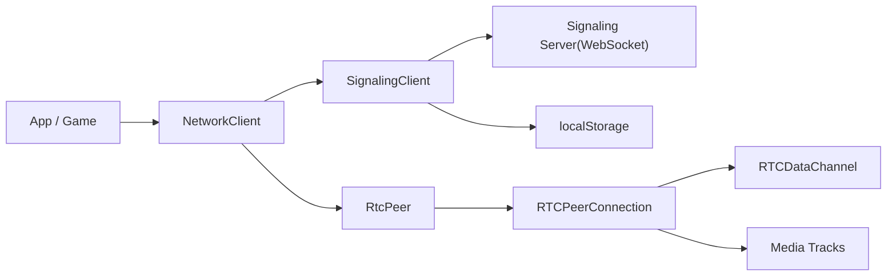
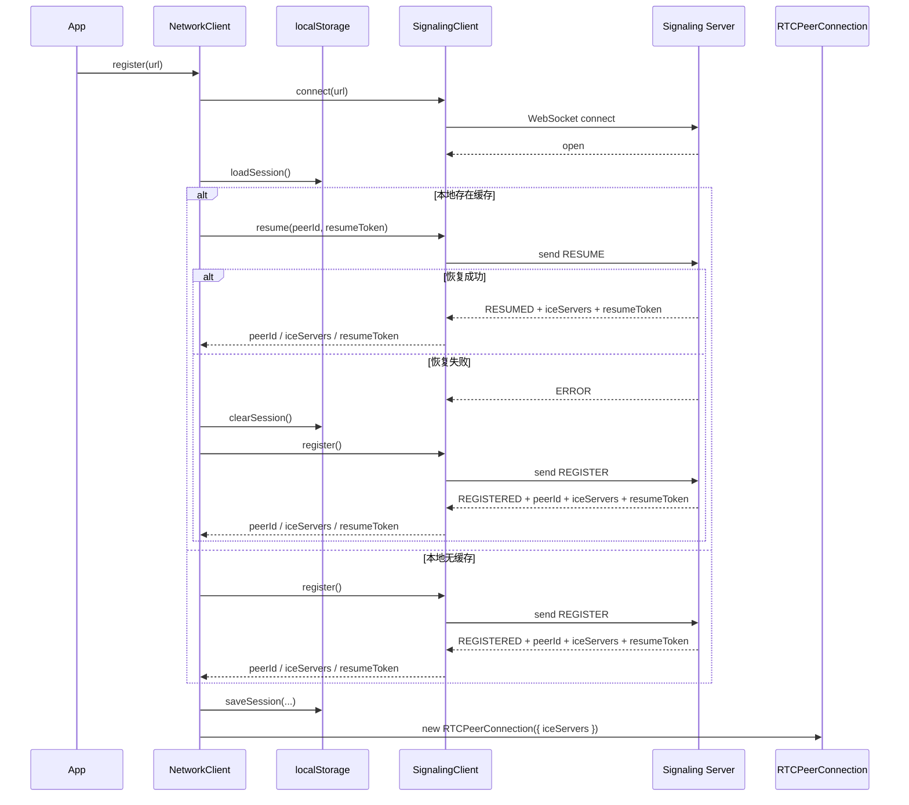
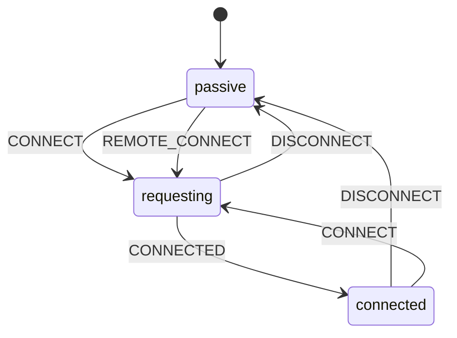
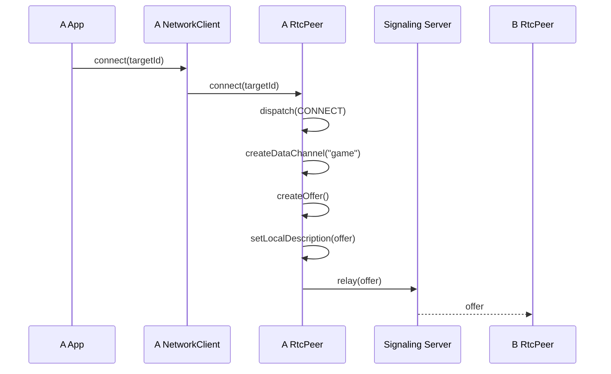
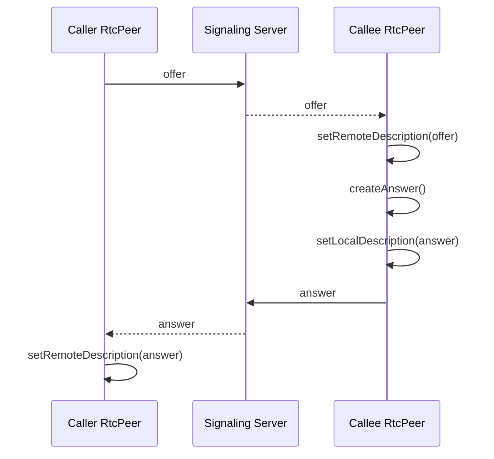
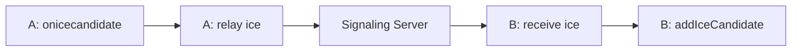
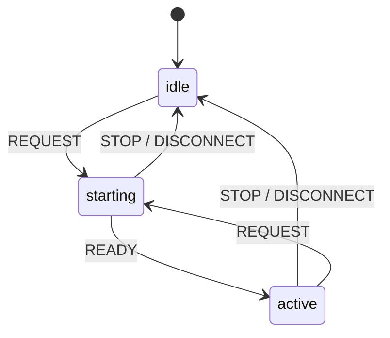

# p2p-lockstep-kit-network 技术讲解

这份文档面向技术介绍、项目复盘和简历讲解，重点解释当前网络层的两条核心链路：

1. `Signaling` 的注册、恢复与本地缓存
2. `PeerConnection` 的建链、DataChannel 通信与媒体协商

对应代码入口：

- `network/index.ts`
- `network/signaling/client.ts`
- `network/signaling/session.ts`
- `network/transport/rtcPeer.ts`
- `network/state/peerState.ts`

---

## 一、项目定位

这个仓库不是游戏逻辑层，而是一个偏底层的浏览器 P2P 网络工具包。它的职责可以概括为：

- 用 `WebSocket` 解决控制面问题：注册、恢复会话、转发 SDP 和 ICE
- 用 `WebRTC` 解决数据面问题：建立点对点连接，承载 DataChannel 和媒体流
- 用一个轻量的 facade `NetworkClient` 向上层屏蔽底层连接细节

整体结构如下：



设计上的核心思路是：

- `SignalingClient` 只管信令，不碰业务消息
- `RtcPeer` 只管 WebRTC 生命周期，不碰页面逻辑
- `NetworkClient` 作为统一入口，负责把“注册/恢复/建连/消息收发/媒体状态”组织成更易用的 API

---

## 二、模块一：Signaling 注册与缓存恢复

### 2.1 这个模块要解决什么问题

P2P 建链前，浏览器必须先拿到一个可被别人识别的 `peerId`，同时还要知道：

- 当前信令服务是否连通
- 之前是否已经注册过
- 是否可以直接恢复上次会话，而不是重新申请新身份
- 当前建链应该使用哪些 `ICE servers`

所以这里的 `signaling` 不是“聊天通道”，而是“控制面入口”。

---

### 2.2 相关文件职责

#### `network/index.ts`

对上层暴露 `register(url)`。它把多个动作串起来：

- 建立 WebSocket
- 读取本地缓存
- 优先尝试 `resume`
- 失败时降级为 `register`
- 保存新的 `resumeToken`
- 用返回的 `iceServers` 创建 `RTCPeerConnection`

#### `network/signaling/client.ts`

实现真正的信令客户端，职责是：

- 建立和维护 `WebSocket`
- 发送 `REGISTER` / `RESUME`
- 接收 `REGISTERED` / `RESUMED`
- 解析服务端返回的 `iceServers` 和 `resumeToken`
- 转发 `RELAY` 类型消息给 `RtcPeer`

#### `network/signaling/session.ts`

实现本地缓存，职责非常单一：

- 从 `localStorage` 读取会话
- 保存会话
- 清理失效会话

缓存字段只有三项：

- `peerId`
- `resumeToken`
- `updatedAt`

这说明缓存层只保存“恢复身份所需的最小信息”，没有把业务状态和连接对象混进来。

---

### 2.3 注册与恢复的完整时序



---

### 2.4 代码级流程拆解

#### 第一步：建立 WebSocket 控制通道

`NetworkClient.register(url)` 会先调用 `this.signaling.connect(url)`。

这一层只做三件事：

- 打开 WebSocket
- 等待 `open`
- 在超时或 `error`/`close` 时拒绝 Promise

这一步成功后，意味着“控制面可用”，但还不代表 P2P 可用。

#### 第二步：读取本地恢复信息

`loadSession()` 会从 `localStorage` 读取：

```ts
{
  peerId,
  resumeToken,
  updatedAt
}
```

它的价值是：

- 页面刷新后还能尝试恢复原来的身份
- 避免每次都申请一个新的 `peerId`
- 减少服务端不必要的重复注册

#### 第三步：优先走 `resume`

如果本地存在缓存，客户端不会立刻重新注册，而是先调用：

```ts
signaling.resume({ peerId, resumeToken })
```

这是一个很实用的设计点，因为它把“断线重连”和“首次注册”区分开了。

这意味着项目不是把 P2P 当作一次性短连接，而是考虑了浏览器刷新、抖动重连、会话恢复这些真实场景。

#### 第四步：恢复失败时自动降级

如果恢复失败，`NetworkClient` 会：

- 调用 `clearSession()`
- 自动回退到 `register()`

这个降级路径很重要，因为它保证了：

- 旧 token 失效时不会卡死
- 客户端始终能退回“重新注册”的稳定路径

#### 第五步：保存新的恢复凭证

无论是 `resume` 成功还是 `register` 成功，只要服务端返回了新的 `resumeToken`，就会执行：

- `saveSession({ peerId, resumeToken, updatedAt: Date.now() })`

这样下次刷新页面，客户端就还能继续尝试恢复。

#### 第六步：把 signaling 返回结果喂给 WebRTC

注册成功后，`NetworkClient` 会立刻用服务端返回的 `iceServers` 创建：

```ts
new RTCPeerConnection({ iceServers })
```

这说明信令服务除了分配身份，还承担了“下发 NAT 穿透配置”的责任。

从架构上看，`Signaling` 模块是 `WebRTC` 的前置依赖。

---

### 2.5 这个实现里比较好的设计点

#### 1. 用 Promise 表达一次性注册流程

当前的 `SignalingClient` 没有把 `REGISTER` / `RESUME` 做成复杂的事件风暴，而是用：

- `pendingRegistration`
- `resolvePendingRegistration`
- `rejectPendingRegistration`

把“一次请求对应一次响应”建模成了 Promise。

这个比纯 `Emitter` 式的临时 `on/off` 更清楚，因为注册本质上不是广播事件，而是 request-response。

#### 2. 缓存层与连接层分离

`session.ts` 只负责本地持久化，不参与连接逻辑。

好处是：

- 容易测试
- 容易替换成别的存储介质
- 不会让缓存逻辑污染信令流程

#### 3. `REGISTERED` / `RESUMED` 都统一落成同一结构

无论是首次注册还是恢复成功，最后都转成：

- `peerId`
- `iceServers`
- `resumeToken`

这让上层 `NetworkClient` 不需要分支处理太多差异，后续建 `RTCPeerConnection` 的逻辑完全一致。

---

### 2.6 可以怎么讲给面试官听

可以这样描述这部分：

> 我把信令层拆成了两部分：一个是 `SignalingClient`，负责 WebSocket 注册、恢复和服务端响应解析；另一个是 `session storage`，只缓存 `peerId` 和 `resumeToken`。注册时客户端会优先尝试恢复旧会话，失败后自动降级到重新注册。这样在浏览器刷新或网络抖动时，不需要每次都生成新身份，也能把服务端下发的 `iceServers` 无缝接到后续的 WebRTC 建链流程里。

---

## 三、模块二：PeerConnection 如何建立连接

### 3.1 这个模块要解决什么问题

拿到 `peerId` 和 `iceServers` 之后，还没有真正连上对端。接下来要完成的是：

1. 创建 `RTCPeerConnection`
2. 主动方生成 `offer`
3. 被动方生成 `answer`
4. 双方交换 `ICE candidates`
5. 等待 WebRTC 底层 transport 进入 `connected`
6. 在连接成功后承载 `DataChannel`
7. 如有需要，再在已有连接上增量协商媒体流

这个仓库里，核心实现集中在 `network/transport/rtcPeer.ts`。

---

### 3.2 状态机定义

项目里对 peer 连接状态做了一个很轻量的 FSM：



三个状态的语义分别是：

- `passive`：当前没有活动连接，等待建立
- `requesting`：已经开始协商，但底层连接尚未真正可用
- `connected`：`RTCPeerConnection.connectionState === "connected"`

这里有一个设计重点：

`connected` 不是“收到了 answer”就算成功，而是严格等到底层 WebRTC transport 真的连通以后，才通过 `connectionstatechange` 推进到 `connected`。

这比“收到 answer 就算成功”更真实，也更适合上层做 UI 状态展示。

---

### 3.3 主动发起连接的流程

主动发起侧调用：

```ts
client.connect(targetId)
```

最终进入 `RtcPeer.connect(targetId)`，流程是：

1. 记录目标 `remoteId`
2. FSM 从 `passive` 进入 `requesting`
3. 创建 `RTCDataChannel("game")`
4. 调用 `createOffer()`
5. 调用 `setLocalDescription(offer)`
6. 通过 signaling 把 `offer` 以 `RELAY` 消息发给目标 peer

对应时序如下：



这里主动方先创建 DataChannel，再生成 offer。原因是：

- DataChannel 本身也是 SDP 协商的一部分
- 如果先创建 offer、后创建 DataChannel，第一次 SDP 里不会包含该通道

---

### 3.4 被动响应连接的流程

当另一端通过 signaling 收到 `offer` 后，会进入 `RtcPeer.handleSignal("offer")`。

被动侧做的事情是：

1. 记录对端 `remoteId`
2. 如果当前还在 `passive`，先派发 `REMOTE_CONNECT`
3. 调用 `setRemoteDescription(offer)`
4. 调用 `createAnswer()`
5. 调用 `setLocalDescription(answer)`
6. 把 `answer` 通过 signaling 回传

时序如下：



这个流程的关键点是：

- `offer/answer` 本身并不直接等于“连接成功”
- 它们只是完成协商参数交换
- 真正的可用状态仍然要等 ICE 和底层 transport 完成

---

### 3.5 ICE candidate 的补充交换

除了 `offer/answer`，WebRTC 建链还依赖 ICE candidate 的交换。

在这个仓库里，`RtcPeer` 会监听：

```ts
pc.addEventListener("icecandidate", ...);
```

一旦本地产生 candidate，就立刻：

- 打包成 `SignalMessage`
- 经 `SignalingClient.relay(...)` 转发给对端

对端收到后再执行：

```ts
pc.addIceCandidate(...);
```

这一步的价值是 NAT 穿透。没有 ICE，P2P 大概率只能停留在“协商过但连不通”。

流程图如下：



---

### 3.6 什么时候才算连上

当前实现里，真正把 peer 状态推进成 `connected` 的触发点是：

```ts
pc.connectionState === "connected"
```

也就是 `RtcPeer` 监听原生：

- `connectionstatechange`

当状态变成：

- `connected` -> 派发 `CONNECTED`
- `closed` / `disconnected` / `failed` -> 派发 `DISCONNECT`

这一点很适合在技术讲解时强调，因为它体现了：

- 业务状态机没有脱离浏览器底层状态瞎跑
- 上层看到的“已连接”是真正 transport ready 的结果

---

### 3.7 DataChannel 与媒体通道的关系

这个项目目前的设计不是“两条独立 PeerConnection”，而是：

- 一个 `RTCPeerConnection`
- 先承载 `DataChannel`
- 媒体流作为这个连接上的增量协商内容

媒体状态机单独维护：



流程是：

1. 上层调用 `startMedia(stream)`
2. `RtcPeer` 进入 `mediaState = starting`
3. 只有当 `dc.readyState === "open"` 时，才允许 `addTrack`
4. track 加入成功后，状态推进为 `active`
5. 如果 DataChannel 关闭，媒体状态会同步回收为 `idle`

这体现的是一个很明确的设计约束：

> DataChannel 是主连接，媒体通道是它的子状态。

这对于需要“先建立稳定数据同步，再决定是否开音视频”的场景比较合适。

---

### 3.8 媒体协商为什么能复用同一条 PeerConnection

当 DataChannel 已经连上后，如果再调用 `startMedia(stream)`，代码会：

- 把本地 track 通过 `pc.addTrack(track, stream)` 注入到现有连接
- 触发 `negotiationneeded`
- 再次生成新的 `offer`
- 继续通过 signaling 把更新后的 SDP 发给对端

这说明当前实现支持：

- 首次只协商数据通道
- 连接建立后再增量协商媒体

这是一种更稳妥的工程化做法，因为：

- 首次建链路径更简单
- 后续功能拓展更灵活
- 断开媒体不必一定重新创建新的信令体系

---

### 3.9 稳定性设计：为什么不会被旧信令污染

这部分是当前实现里比较容易被忽略，但实际很重要的点。

`RtcPeer` 里有几个防串扰设计：

#### 1. `dispose()` 会解绑 signaling 监听

在创建新的 peer 前，旧实例会：

- `offSignal`
- 移除所有 `RTCPeerConnection` 监听
- 清理 DataChannel
- 回收状态

这样可以避免重连后旧实例继续消费新的信令消息。

#### 2. `shouldHandleSignal(message)` 会过滤不属于当前连接的信令

当前 peer 只有在以下情况下才处理 signal：

- `offer`：当前是 `passive`，或本来就是同一个 `remoteId`
- `answer/ice`：必须来自当前 `remoteId`

这避免了旧连接遗留 `answer` 或 `ice` 把当前连接打乱。

#### 3. 异步流程统一走 `runTask`

像这些异步动作：

- `handleSignal`
- `startOffer`
- `negotiate`

都会被 `runTask` 包起来。失败时统一执行：

- `dispatchMedia("DISCONNECT")`
- `dispatch("DISCONNECT")`

这样至少能保证失败后状态机收回到可重新连接的状态，而不是卡在半路。

---

### 3.10 可以怎么讲给面试官听

可以这样概括：

> 我在 WebRTC 建链层做了一个轻量状态机，把连接过程拆成 `passive/requesting/connected`。主动端先创建 DataChannel，再发起 offer；被动端收到 offer 后生成 answer；双方通过 signaling 继续交换 ICE candidate。只有当浏览器原生的 `RTCPeerConnection.connectionState` 进入 `connected`，业务状态才会切换为已连接。媒体流不是单独开第二条 PeerConnection，而是在 DataChannel 建立后通过 `addTrack + negotiationneeded` 增量协商，这样数据和媒体可以复用同一条 P2P 通道，同时保持更清晰的生命周期边界。 

---

## 四、从上层调用视角理解整个流程

如果站在业务层看，最重要的只有四个动作：

```ts
const client = new NetworkClient();

await client.register("wss://your-signaling-server");
await client.connect(targetPeerId);

client.onMessage((payload) => {
  console.log(payload);
});

client.send({ type: "move", x: 3, y: 5 });
```

上层只看到：

- `register`
- `connect`
- `onMessage`
- `send`

但底层实际完成了：

- WebSocket 建立
- 会话恢复或注册
- localStorage 缓存
- ICE 配置注入
- SDP 协商
- ICE 交换
- DataChannel 建立
- JSON 编解码
- 连接状态回调
- 可选媒体流协商

这说明这个仓库的价值不在于“把 WebRTC API 简单包一层”，而在于把一组离散的浏览器底层能力收束成了一条更稳定的网络接入路径。

---

## 五、适合写进简历的表达

下面这版更适合直接写进项目经历：

### 精简版

- 设计并实现浏览器端 P2P 网络层，基于 `WebSocket + WebRTC` 完成信令注册、会话恢复、ICE 配置下发和点对点连接建立。
- 封装 `NetworkClient / SignalingClient / RtcPeer` 三层结构，统一管理注册、重连、DataChannel 消息收发和媒体协商。
- 引入本地 `resumeToken` 缓存机制，支持页面刷新后的会话恢复，并在恢复失败时自动降级到重新注册。
- 为 `RTCPeerConnection` 设计轻量状态机，严格以原生连接状态驱动 `connected/disconnect` 迁移，降低建链过程中的状态漂移风险。
- 支持在已建立的 DataChannel 上增量协商媒体流，实现“数据优先、媒体后置”的单连接复用方案。

### 面试展开版

- 控制面用 WebSocket，只处理注册、恢复和 SDP/ICE 转发；数据面用 WebRTC，只处理真正的 P2P 传输。
- 注册流程优先尝试恢复旧会话，减少重复分配 peerId，并把服务端返回的 ICE 配置直接注入 PeerConnection。
- 建链流程中，主动方先创建 DataChannel 再发 offer，被动方生成 answer，随后双方持续交换 ICE candidate，直到浏览器底层 transport 真正进入 connected。
- 媒体流通过 `addTrack + negotiationneeded` 在既有连接上增量协商，而不是新开第二条 PeerConnection，简化了通道管理。

---

## 六、总结

这个项目的核心技术价值不是“会调 WebRTC API”，而是把下面这些问题串成了一个可工作的网络模块：

- 如何为浏览器分配可恢复的 peer 身份
- 如何把 signaling 和 data plane 解耦
- 如何用状态机表达 PeerConnection 生命周期
- 如何在 DataChannel 之上继续扩展媒体能力
- 如何在重连、失败、旧消息串扰下保持状态一致

如果你把这份文档拿去做简历或面试说明，建议重点突出两点：

1. 你做的不是单点 API 调用，而是完整的连接编排
2. 你考虑了恢复、状态一致性、增量协商和资源回收这些真实工程问题
